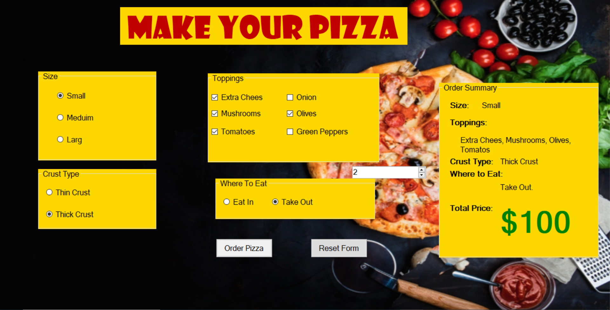

# Order Pizza 🍕

A simple desktop application built with C# and Windows Forms for ordering pizza.

---

## Project Description

This application allows users to select the type and size of pizza, add toppings, and automatically calculates the total price in an easy and quick way.

---

## Requirements

- Windows OS
- Visual Studio 2019 or later
- .NET Framework (usually 4.7.2 or higher)

---

## How to Run

1. Clone the repository.
2. Open the `OrderPizza.sln` or `OrderPizza.csproj` file in Visual Studio.
3. Click the Start button to run the application.
4. The app interface will appear where you can test placing orders.

---

## Project Structure

- **Form1.cs**: The backend code for the main form.
- **Form1.Designer.cs**: The UI design code.
- **Form1.resx**: The form resources.
- **Program.cs**: The entry point of the application.
- **OrderPizza.csproj**: The project configuration file.

---

## Future Improvements

- Add saving orders to a file or database.
- Improve the user interface design.
- Add discounts and promotional offers.

---

## Screenshot (Optional)

*You can upload a screenshot image to the `assets` folder and update this link.*

---

## License

This project is open source and free to use and modify.

---

Thank you for using this project!  
If you encounter any issues or have suggestions, please open an Issue in the repository.
